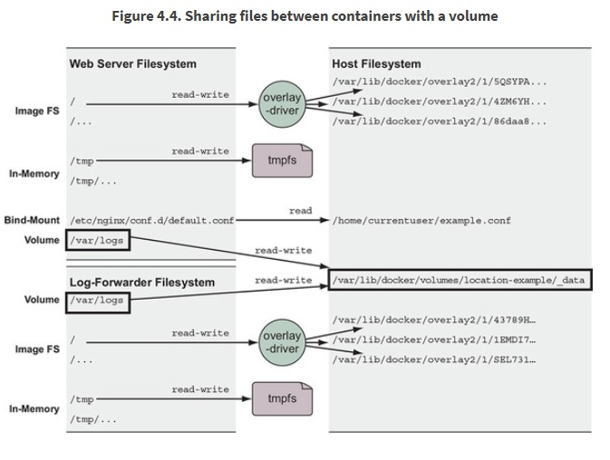

# Docker in Action

## Heading

Becoming a super hero is a fairly straight forward process:

```
$ give me super-powers
```


 Super-powers are granted randomly so please submit an issue if you're not happy with yours.


Once you're strong enough, save the world:


```bash
# Ain't no code for that yet, sorry
echo 'You got to trust me on this, I saved the world'
```


## 4. Working with storage and volumes

### 4.2 Bind mounts

Bind mounts are mount points used to remount parts of a filesystem tree onto other location. When working with containers, bind mounts attach a user-specified location on the host filesystem to a specific point in a container file tree.


How to print all mounts points? if I mount point into container can I see this mount point from host?

[https://unix.stackexchange.com/questions/24182/how-to-get-the-complete-and-exact-list-of-mounted-filesystems-in-linux](https://unix.stackexchange.com/questions/24182/how-to-get-the-complete-and-exact-list-of-mounted-filesystems-in-linux)


```bash
touch ~/example.log
cat >~/example.conf <<EOF
server {
  listen 80;
  server_name localhost;
  access_log /var/log/nginx/custom.host.access.log main;
  location / {
  root /usr/share/nginx/html;
  index index.html index.htm;
  }
}
EOF
```

```bash
CONF_SRC=~/example.conf; \
CONF_DST=/etc/nginx/conf.d/default.conf; \
LOG_SRC=~/example.log; \
LOG_DST=/var/log/nginx/custom.host.access.log; \
docker run -d --name diaweb \
  --mount type=bind,src=${CONF_SRC},dst=${CONF_DST} \
  --mount type=bind,src=${LOG_SRC},dst=${LOG_DST} \
  -p 80:80 \
  nginx:latest
```

Expanding on this use case, suppose you want to make sure that the NGINX web server can't change the contents of the configuration volume. Linux provides a mechanism to make mount points read-only.

```bash
docker rm -f diaweb

CONF_SRC=~/example.conf; \
CONF_DST=/etc/nginx/conf.d/default.conf; \
LOG_SRC=~/example.log; \
LOG_DST=/var/log/nginx/custom.host.access.log; \
docker run -d --name diaweb \
  --mount type=bind,src=${CONF_SRC},dst=${CONF_DST},readonly=true \
  --mount type=bind,src=${LOG_SRC},dst=${LOG_DST} \
  -p 80:80 \
  nginx:latest
```

By creating the read-only mount, you can prevent any process inside the container from modifying the content of the volume.


PoC:

```text
docker exec diaweb \
    sed -i "s/listen 80/listen 8080/" /etc/nginx/conf.d/default.conf
```



The first problem with bind mounts is that they tie otherwise portable container description to the filesystem of a specific host.

The next big problem is that they create an opportunity for conflict with other containers. It would be bad idea to start multiple instance of Cassandra that all use the same host location as a bind mount for data storage.


### 4.3 In-memory storage

Most service software and web application use private key files, database password, API key files, or other sensitive config files, and **need upload buffering space**.


This is useful to temporarily store sensitive files that you don’t want to persist in either the host or the container writable layer.


```bash
docker run --rm \
    --mount type=tmpfs,dst=/tmp \
    --entrypoint mount \
    alpine:latest -v
```

You can add size limit and change the file mode using options **tmpfs-size** and **tmpfs-mode.**

```bash
docker run --rm \
    --mount type=tmpfs,dst=/tmp,tmpfs-size=16k,tmpfs-mode=1770 \
    --entrypoint mount \
    alpine:latest -v
```

### 4.4 Docker Volumes



Docker volumes are named filesystem trees managed by Docker. They can be implemented with disk storage on the host filesystem, or another more exotic backend such as cloud storage. By default, Docker creates volumes by using the **`local`** volume plugin.

Create a volume named `location-example` and display the location of the volume host filesystem tree:

```bash
docker volume create \ 
    --driver local \
    --label example=location \
    location-example
docker volume inspect \
    --format "{{json .Mountpoint}}" \
    location-example
```

4.4.2 Using volumes with a NoSQL database

Get started by creating the volume that will store the Cassandra database files. **Add label** to the volume with the key example and the value cassandra.

```bash
docker volume create \
    --driver local \
    --label example=cassandra \
    cass-shared
```

Create a new container running Cassandra:

```bash
docker run -d \
    --volume cass-shared:/var/lib/cassandra/data \
    --name cass1 \
    cassandra:2.2
```


Nice separation strategy!

run a Cassandra client tool \(CQLSH\) from the same image but in another container !!! and connect to your running server:


```bash
docker run -it --rm \
    --link cass1:cass \
    cassandra:2.2 cqlsh cass
```

Inspect Cassandra database from the CQLSH command line:

```bash
select *
from system.schema_keyspaces
where keyspace_name = 'docker_hello_world';

# Create keyspace
create keyspace docker_hello_world
with replication = {
    'class' : 'SimpleStrategy',
    'replication_factor': 1
};

# Repeat query

# Leave ans stop current container
quit

# Stop and remove the Cassandra node
docker stop cass1
docker rm -vf cass1
```

Test recovery of the data:

```bash
docker run -d \
    --volume cass-shared:/var/lib/cassandra/data \
    --name cass2 \
    cassandra:2.2

docker run -it --rm \
    --link cass2:cass \
    cassandra:2.2 \
    cqlsh cass

select *
from system.schema_keyspaces
where keyspace_name = 'docker_hello_world';
```

### 4.5 Shared mount points and sharing files


