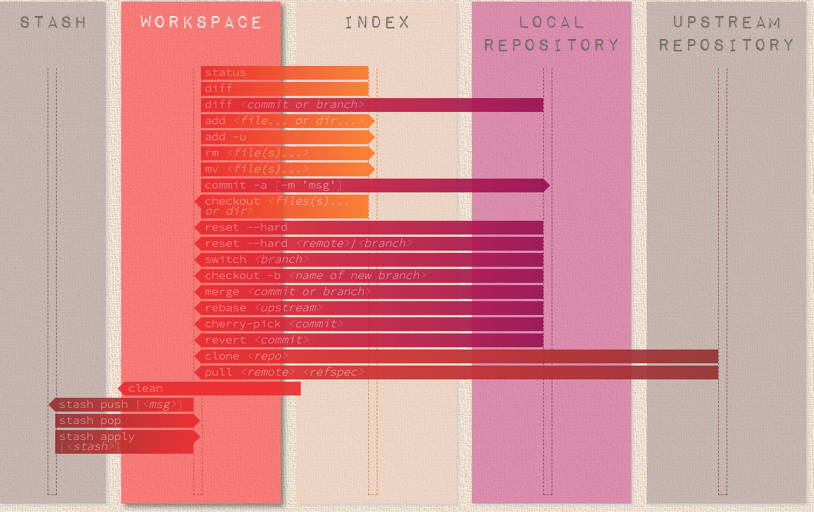

# Git && GitHub

## Git







### Edit last commit msg

`git commit --amend` add more changes to the last commit by staging before exec `--amend`

`-a` is not `--amend` first automatically "add" changes from all known files.

alias for zsh: `gc!` = `git commit -v --amend`

if you want to edit older commit msg:

```text
git rebase -i HEAD~5
# (editor) replace pick with reword, save&quit
# for each reword new text editor will open
# if already pushed upstream, than U need to use force
git push --force <brand-name>
```

### Commit only part of code

`git add -p,--patch <filename>` 

### Interactive Staging

`git add -i`

### Undo uncommitted changes

`git reset` this will unstage all files.

`git checkout [dir|file|.]` will revert local uncommitted changes, same as `git reset --hard HEAD`

### Undo the last commit

`git reset --soft HEAD~1` 

`reset` copied the old head to `.git/ORIG_HEAD`

`commit` with `-c ORIG_HEAD` will open an editor, which initially contains the log message from the old commit and allows you to edit it.

```text
$ git commit -m "Something terribly misguided" # (0: Your Accident)
$ git reset HEAD~                              # (1)
[ edit files as necessary ]                    # (2)
$ git add .                                    # (3)
$ git commit -c ORIG_HEAD                      # (4)
```



## GitHub

### Actions

YAML file `.github/workflows/*.yaml`

* U can re-run jobs

Links:

* Experimenting with Github Actions [link](https://seandavi.github.io/post/learning-github-actions/)
* Configuring a workflow [@GitHubDoc](https://help.github.com/en/actions/configuring-and-managing-workflows/configuring-a-workflow#adding-a-workflow-status-badge-to-your-repository)

### Badge

Action dashboard -&gt; choose workflow -&gt; Create status badge paste it onto README.md

## Lab

1. Commit only part of code
2. Do staging interactive


